# Doctor Kevin House
- Please run pipenv shell
- cd into the lib directory
- run Python seed_2.py to populate the database with data
- once finshed run Python cli.py to start the program

## Project requirements

In this project, we're going to use these skills to create a CLI. You won't be able to fit everything in from phase 3, but the following are the minimum requirements:
- A CLI application that solves a real-world problem and adheres to best practices.
- A database created and modified with SQLAlchemy ORM with 2+ related tables.
- A well-maintained virtual environment using Pipenv.
- Proper package structure in your application.
- Use of lists and dicts

Consider these stretch goals as you progress through your project:

- database created and modified with SQLAlchemy ORM with 3+ related tables.
- Use of many-to-many relationships with SQLAlchemy ORM.
- Use of additional data structures, such as ranges and tuples.

## Creating project
To start the project I used the template provided by the course for phase 3 project. I then removed the metadata as instructed using rm -rf .git .canvas
This removed the Git Repo and allows me to create and track my own local repository and push it into my own Git Repo. I renamed the file to project name, the used git init
to create my local repository. git add --all then added all the local files. git commit -m'initial commit' made my first commit and commit al my saved work to the repository. I creatyed a new reposiroty on my GitHub website. I copied the shh and ran git remote add origin `<github url>` to map my local repository to my git hub repo. Finally i pushed using git push -u origin main to make my first push and upload my project to my github repo.

## Installing necessary libraries and packages
For this project i install sqlalchemy and alembic to start. 

    pipenv install sqlalchemy alembic
installed the sqlalchemy library anlong with the alembic library. Then I was ready to enter my pip enviroment. 

    pipenv shell
## Functionality
### This project runs on SQLAlchemy and many packages. The version of python used is 3.8

### Terminal loads 

The terminal displays a message of my project name, _DOCTOR-KEVIN_HOUSE_, and a small greting. The user is prompted to select one of two choices, either Login or Exit. Exit will end the program. If the user selects Login it will take the user to the EMPLOYEE-LOGIN where the user is prompted to enter an email to login into there personal acount with there employee ID as the current user. Once an accepted email has been inputed the user will be directed to the home screen. 

### Home 
A greeting will be displayed showing the current users name. A few options will be displayed allowing the user to choose one of the options and continue with tye program as they need. 

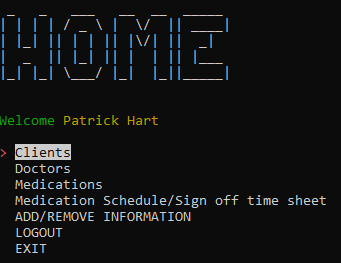

### def handle_client_Choice(self)
If the user selcts the clients option they will directed to the method handle_client_choice. A while loop is used to keep the user inside the client choice for as long as the wish to be, in can be broken when the return_home variable is set to True. A message is printed to choose an option 
            
    options = [
        'View all clients', 
        'Search by name', 
        'Search by ID', 
        'Return to main screen'
    ]
    terminal_menu = TerminalMenu(options)
    menu_entry_index = terminal_menu.show()
A method from the sessions.py file is called, create_client_session, that has created a Client session. 
If the user selects _View all clients_, a list of clients will appear on the terminal. These are all the clients available in the client table. This is done by running a for loop and going threw all the instances stored in the client class. 

    if options[menu_entry_index] == 'View all clients':
        print(green('LIST OF ALL CLIENTS:'))
        for client in clients.all():
            print(client)
Once the user is satisfied with the viewing of the data they are prompted to press any key to return to the top of the loop and asked to choose another option in the client class. 
If the use chooses _Search by name_, the user is then promted to eneter a clients name. The program will use a method .filter() to filter all the instances in the clients table and see if there is a client with that name. If a name is found the clients information will print along with their medication time slots. The medication time slots are posiible because of a one-to-many relationship estabblished between the client and the med_times classes. 

    for client in client_filter_name:
        print(client)
        print(green(f'Medications perscribed: '))
        for meds in client.medications:
            print(meds.medications.name)
        print(green(f'Medication schedule for {client.name}'))
        for times in client.medications:
            print(times)
if the user selects _search by id_ then the user is prompted to input an ID of a specific client. The id is specific because there may be multiple cliets with same exact name but we can distiguise them by there id. Once the user inputs there ID thed filter method searches for the ID just like the name as described in the previus option. The id holder is then printed out along with the medications times that the cliet has. 

    print(green('Client: '))
    for client in client_filter_id:
        print(client)
        print(green(f'Medications perscribed: '))
        for meds in client.medications:
            print(meds.medications.name)
        print(green(f'Medication schedule for {client.name}'))
        for times in client.medications:
            print(times)
if the user selects the final option of _Return to main screen_ then the return_home value becomes True

    else:
        return_home = True
This breaks the while loop and returns the user to the home screen where they are prompnted again to choose from wich table they want to see data, along with the classes relationships with other classes.

### def handle_doctor_choice(self)
The doctor choice is similar to the client method. There is a while loop that loops until the user decides to return to the main screen, _Return to main screen_. The options for the doctor class are very similar to the clients.

    options = [
        'View all doctors', 
        'Search by name', 
        'Search by ID', 
        'Return to main screen'
    ]
    terminal_menu = TerminalMenu(options)
    menu_entry_index = terminal_menu.show()
if the user selcts _View all doctors_ a list of all the doctors in the doctors table will print out. The data that prints is the return data from the repr() method in located in all the classes. 

     if options[menu_entry_index] == 'View all doctors':
        print(green('LIST OF ALL DOCTORS: '))
        for doctor in doctors.all():
            print(doctor)

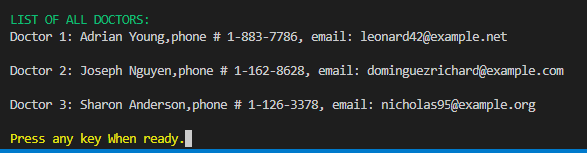

If the user wishes to search the doctor by name they are prompted to type the name of the doctor. If the doctor is in the database all the doctors with that name will then be printed out along with all of there clients that they take care of. 

    print(green('Doctor(s): '))
    for doc in doctor_filter_name:
        print(doc)
        print(green('List of clients'))
        for client in doc.clients:
            print(f'{client.name}, ID: {client.id}')
Similar to choosing _Search by name_, if the user wishes to look for the doctor based on a more precise way, there id, they can do that by choosing the _search by id_ option. The user is promted to eneter the doctors id. If the id is a valid id then the doctors information is displayed along with a list of there specific clients. 

    print(green('Doctor: '))
        print(doctor_filter_id[0])
        print(green('List of clients'))
        for client in doctor_filter_id[0].clients:
            print(f'{client.name}, ID: {client.id}')
Once the user is done with the doctor option, they can choose the final option of _return to home screen_ which will set the return_home = True and break the while loop sending the user back to the home screen to select another choice. 

    self.home_screen()
### def handle_medication_choice(self)
If the user selects the Medication option it takes them to the 'medication screen'. This part of the project is similar to the other sections that came before. it has the opstion of selecting to see all the medications, search by name, search by id or return to main screen.

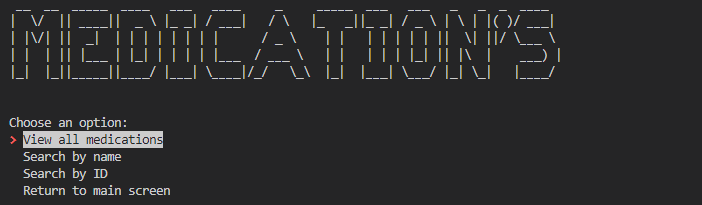

If the user selects _View all medications_ a list of all the medications will be desplayed along with their id and a small description of every medication.
If the use decides to search by name then the user is propmted to enter the name of the medication. If the medication is in the database then the screen will print the name of the information on the madeication along with a list of clients that take that specific medication. 

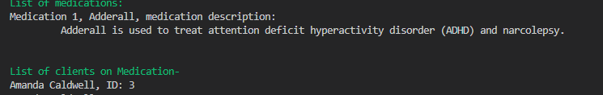

The same result and procedure is required if the user wants to search for a medication based on the id of the medication. The use is prompted to enter the id of a specific medication and then the information is displayed along with a list of all the clients that take that medication. 

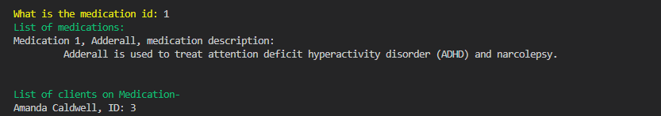

Once the user is done with the medication option they can select return to main screen to break the while loop and return to the home screen.

### def handle_med_schedule_choice(self)
This option is a little different from the rest of the options. It has a a list of options 

    options = [
        'Sign Off medication time slot', 
        'View medication schedule', 
        'Filter by time', 
        'Return to main screen'
    ]
    terminal_menu = TerminalMenu(options)
    menu_entry_index = terminal_menu.show()
If the user selects _Sign Off medication time slot_ it prompts them to enter a clients id, the value must be valid or else it will display an error and promt you again. Then the user is given a list of time slots to choose from, from 4:00 to 24:00 in intervals of 4. 

    print(green('Enter the client information and the time slot you want to sign off.'))
    client_id = validate.validate_client_id()
    time_slot = helpers.time_slots()
    client_id_signoff = medications.filter(Med_times.client_id == client_id)
    sign_off_time = client_id_signoff.filter(Med_times.time_slot == time_slot) 
    print(sign_off_time[0])
    user_input = input(green('Is this correct? (Y/N): '))
    if user_input == 'y'or user_input =='Y' or user_input =='yes'or user_input == 'Yes':
        sign_off_time[0].signed_off = self.current_user.id
        sessions.session_create().commit()
        print(yellow(str(sign_off_time[0]))) 
        print(green('\thas been signed by you.')) 
    else:
        print(red('SIGN OFF WAS NOT SUCCESSFUL'))
After the user has selected both a valib client id and a time slot, if it exists in the database, the user will be prompted to answer if they to sign off this time slot. If yes then the table will be mofied to display and have a new value of the current users id as the sign off. If the user decides no, then the table and values stay the same.

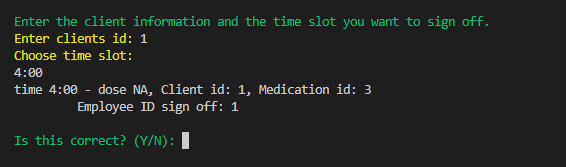

If the user chooses _View medication schedule_ the entire medication schedile will print. 

    if options[menu_entry_index] == 'View medication schedule':
        print(green('MEDICATION SCHEDULE: '))
        for times in medications.all():
            print(times)
If the user chooses the _filter_by_time_ option they will prompted by a list of time slots. Depending onm the choice, all the time slots with that value will print. 

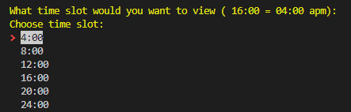

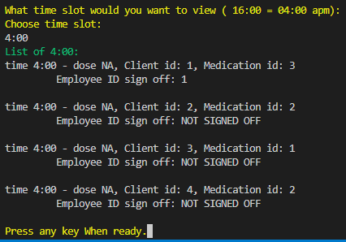

Just like all the other options before there is option _return to main screen_ that will break the while loop and return the user to tye main screen.

### def handle_modify_info(self)

The final option _ADD/REMOVE INFORMATION_ is so that the user can remove and add data to the database. The user is prompted to select an option

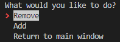

#### REMOVE
If the user selects remove they arte then promted to choose between client and medication scheduling. 

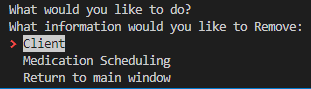

If the user selects clients they are promted to either select a client or a time schedule. If the user selects client they are prompted to enter the clients id they wish to remove. 

    for times in time_slot:
        session.delete(times)
        session.commit()
    
    session.delete(client[0])
    session.commit()
The code above takes a filtered version of the object and deletes all the instances if that client is in the client table and also deletes any instances of their medication schedule. 
If the user chooses medication schedule the user is prompted to select a time slot. 

The the user is promted to eneter a clients id. Once the user has eneterd there options the time slot will be remove from the table and from the dataframe. 

    time_slot = client.filter(Med_times.time_slot == med_time)
    if time_slot.count() != 0:
        session = sessions.session_create()
        session.delete(time_slot[0])
        session.commit()
        print(green('The time slot on the schedule has been removed'))

#### ADD
If the user selcts _add_ a similar screen will appear promting the user to select between client and medication schedule. If the user selects client the user will be promted to enter new clients name, age, their primary doctor, and if the user is signing off the time slot. If the user selects that they are going to sign off the new instance is created with the information that the user provided. 

    new_client = Client(
        name = new_client_name,
        age = new_client_age,
        doctor_id = new_client_doc,
    )
    session = sessions.session
    session.add(new_client)
    session.commit()
If the user selects to add a medication schedule, the user is promted to select a time slot. A client id is then required to distinguise who the medication schedule this is is being made for. The user is prompted to eneter a medication id to be able to know what medication needs to be distributed at that time. Finally the user is asked i they are signing off the slot with their id. If the user selects yes then the time slot is created with the provided information and with the users id as the signed off value for that instance. If the user selects no then the slot is still created exept the signed_off value becomes NOT SIGNED OFF. 

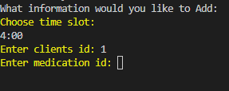

    new_medicatiion_slot = Med_times(
        time_slot = new_time_slot,
        dose = new_dose,
        signed_off = new_sign_off,
        client_id = new_client_id,
        medication_id = new_med_id,
    )

### LOGOUT
If the user decides that they are done using the program but dont want to exit the program and maybe let another user login they can select the logout option. 

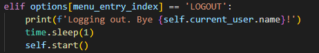

This option will log the user out by sendinf them to the calling login(). This will return the user to the login page where the nect user can log in or exit the program.

### EXIT
This option does the same thing that the original exit option does. It calls the exit() method and quits the project all together. 

## modyfy_database.py
This file is the file that holds all the methods i used to modify the database and classes. They prevented me from cluttering my cli file and also made it easier to debug when i had an issue. 
In this file is where the methods to add and remove instances of classes live. 

## sessions.py
In this file i craeted the session of each object and returned them to use them whenever i needed them. This helped me prevent repeating code to make new sessions everytime i enetered a new option in the project.

    from sqlalchemy import create_engine
    from sqlalchemy.orm import sessionmaker
    from sqlalchemy.ext.declarative import declarative_base

    from  db.models import Doctor, Med_times, Client, Medication, Employee

    Base = declarative_base()
    engine = create_engine('sqlite:///db/client_database.db')
    Session = sessionmaker(bind=engine)
    session = Session()

    def session_create():
        return session

### helper.py and validate.py
These files help me write a method to validate inputs and print the options of wthje time displays. They help shorten my code and easier to debug. 
    
    def check_if_integer(user_promp):
    good_input = False
    while good_input == False:
        num = input(yellow(user_promp))
        if num.isdigit():
                return int(num)
        else:
            print(red('Value must be a number.'))
The top snippet is an example of a method that helps me validate the user inputs a valid integer when integer is required. 

### models.py
In this file I made all the migrations that made my classes into tables for my database. I used sqlalchemy and alembic packages. Every time I added a class, added a column, or added some kind of relationship I would run 

    alembic revision --autogenerate -m 'message'

This made every migrations add to my table or attributes to specific tables. The Doctor class has a one-to-many relationship with the client class. Every doctor a=can have many clients and many clients can have the same doctor. In the client class i used a foreign key argument for a column to link the doctors id to the doctor class and help me find the specific doctor that belonged to the client. In Doctor class i assigned an attribute that linked the doctor class to the client class and when called, it retured a list of all the clients that belonged to that doctor. This was all posible with the id of the doctor.
This is similar how i created the relationship between employee and med-times. Many med times can have an employee and one medtime can only have one employee. 
For many-to-many realationships i linked the client class to the medacation class using another class Med_times. This class took 2 foreing keys, one from the client and one from the medication. This is how i created the relationship between clients and medications and displayed it in a table.  
All of the classes have a primary key that is an id and columns that have data to make the table make sence and valuable. The tables where used in my cli project to display the data in an organized simple way to see and I used sqlalchemy to be able to create a project to filter, modify, add, and remove information using metadata of the client_database.db.

## Contributations
Pull request are appreciated. Any feed back on improving the project(do's and dont's).

## Citations
All medications exept adderal:
- Brennan, D. (2021, October 4). What are the top 10 most prescribed drugs?. MedicineNet. https://www.medicinenet.com/what_are_the_top_10_most_prescribed_drugs/article.htm 

Adderal description and name:
- Durbin, K. (n.d.). Adderall: Uses, dosage, Side Effects &amp; Safety Info. Drugs.com. https://www.drugs.com/adderall.html 

### Licence
MIT License

Copyright (c) 2023-present Kevin Bravo

Permission is hereby granted, free of charge, to any person obtaining
a copy of this software and associated documentation files (the
"Software"), to deal in the Software without restriction, including
without limitation the rights to use, copy, modify, merge, publish,
distribute, sublicense, and/or sell copies of the Software, and to
permit persons to whom the Software is furnished to do so, subject to
the following conditions:

The above copyright notice and this permission notice shall be
included in all copies or substantial portions of the Software.

THE SOFTWARE IS PROVIDED "AS IS", WITHOUT WARRANTY OF ANY KIND,
EXPRESS OR IMPLIED, INCLUDING BUT NOT LIMITED TO THE WARRANTIES OF
MERCHANTABILITY, FITNESS FOR A PARTICULAR PURPOSE AND
NONINFRINGEMENT. IN NO EVENT SHALL THE AUTHORS OR COPYRIGHT HOLDERS BE
LIABLE FOR ANY CLAIM, DAMAGES OR OTHER LIABILITY, WHETHER IN AN ACTION
OF CONTRACT, TORT OR OTHERWISE, ARISING FROM, OUT OF OR IN CONNECTION
WITH THE SOFTWARE OR THE USE OR OTHER DEALINGS IN THE SOFTWARE.